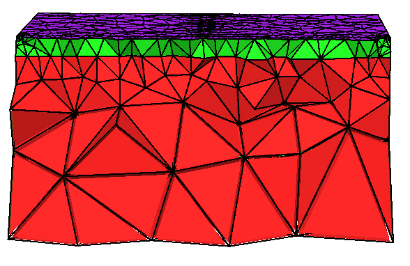

This is TetGen version 1.5.1 ,Please see the documentation of TetGen for compiling and using TetGen. It is available at the following link:
http://www.tetgen.org
After compilation, this code can generate unstructured grids for geological models, which are used to handle the construction of complex terrains.
If you need it, you can follow the following steps.
<h1>Usage</h1>
<h1>1. Download</h1>
Download code from the Github repository: 
https://github.com/Geo-prediction2025/Mesh-generation.git, and install a software Codeblocks.
 
<h1>2.Create a new project:</h1>
a)Create a new console application project and name it ‘tetgen’.
b)Delete the default main.cpp file located under the project's source files.
Copy TetGen source files:
d)Extract the TetGen package.
e)Copy all extracted files into the project's source file directory (tetgen).
f)Right-click and Add Files: add the header files (.h suffix) and the two source files (.cxx suffix).

<h1>3. Configure Project Properties</h1>
a)Right-click on the project tetgen and select Properties.
b)Check the option: This is a custom Makefile.
c)Verify the absolute path to the Makefile is correct.
Configure Build Options:
d)Right-click and select Build options....;Navigate to the Make commands;Delete all instances of "$target" .
e)Build the Project:Click the Build button (yellow gear icon).Wait a few seconds. If successful, an executable file named tetgen.exe will be generated in the project folder. Compilation is complete!

<h1>4. Test and Verification Phase</h1>
Important: Set the Environment Variable!
Right-click on 'Computer' / 'This PC', select Properties -> Advanced system settings -> Environment Variables....
In the System variables section, select the Path variable and click Edit....
Click New and add the absolute path to the directory containing the tetgen.exe executable (e.g., D:\tetgen).

<h1>5. Run TetGen</h1>
Open the Command Prompt (cmd). (e.g., Right-click the Start button -> select Run -> type cmd).
The basic command format is: tetgen [options] <input_file>
Example: tetgen -pq1.2A D:\tetgen\example.poly
Press Enter.
Successful Execution
If successful, TetGen will generate four output files (e.g., .node, .ele, .face, .edge), indicating the model was meshed successfully.

<h1>6. A two layered mesh example</h1>

